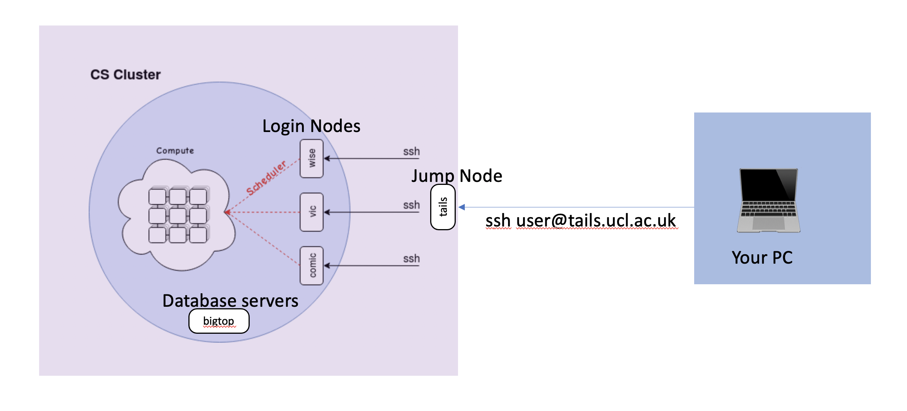

# High Performance Cluster (HPC) short tutorial for UCL AI-Enabled Healthcare CDT

## Why use the HPC?
* No CUDA enabled GPU on your laptop
* Don’t want your laptop to become a radiator
* Run parallel experiments and get results quicker
* Hyperparameter optimization
* BIG GPU’s
* Free service
* Relatively high freedom to manage your own environment
* Learn key skills for industry 
* Secure place to store healthcare data
* Active support

## Why not use the HPC?
* Takes time to setup
* Job queue times 
* Unix is hard and ugly
* Unfamiliar environment
* I have a huge GPU in my desktop it’s enough for what I want to do
* Prefer to learn commercial cloud services (AWS GCP AZURE)

## Getting access

First of all, it's worth checking if your supervisor already has accesss to HPC services and then requesting an account there. 

If not you can request an account:
* CS HPC at https://hpc.cs.ucl.ac.uk/account-form/ 
* UCL Research Center at https://signup.rc.ucl.ac.uk/computing/requests/new

This guide is going to use the CS HPC cluster but both should be similar.

The IHI is also in the process so procuring its own HPC services but we're not there yet :(.


## How does it work?



## Logging In

<p align="center">
  
</p>

## Scheduler

###qsub
Submit a job to the scheduler with qsub
```bash
qsub /path/to/submission/script/
```
### qstat
Get the status of a job with qstat
```bash
qstat
job-ID  prior   name       user         state submit/start at     queue                          slots ja-task-ID 
-----------------------------------------------------------------------------------------------------------------
6506636 0.00000 testing    jbloggs      qw    21/12/2012 11:11:11                                    1     
qstat -j <job-ID>
```

### q
Submit a job to the scheduler with qsub
```bash
qsub /path/to/submission/script/
```


