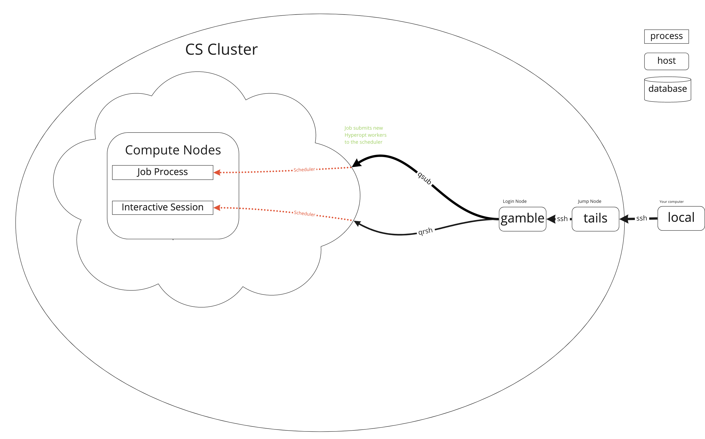
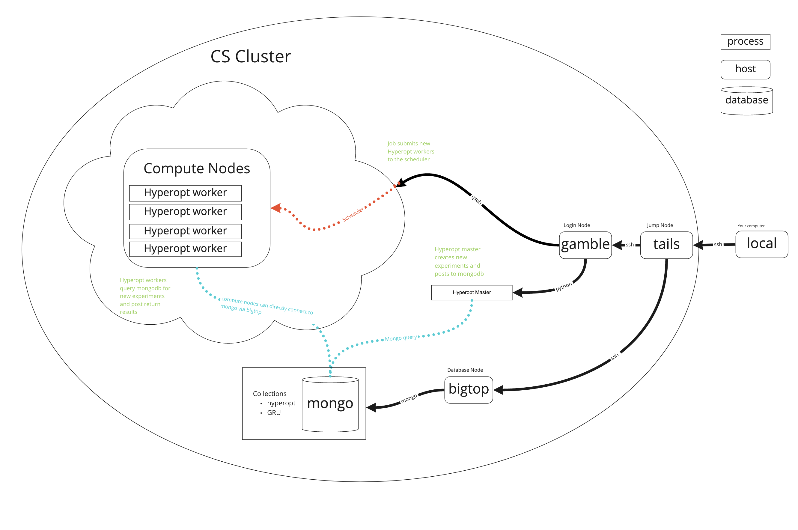

# High Performance Cluster (HPC) short tutorial for UCL AI-Enabled Healthcare CDT

## Why use the HPC?
* No CUDA enabled GPU on your laptop
* Don’t want your laptop to become a radiator
* Run parallel experiments and get results quicker (10-20+ GPUs!)
* Hyperparameter optimization
* BIG GPU’s
* Free service
* Relatively high freedom to manage your own environment
* Learn key skills for industry 
* Secure place to store healthcare data
* Active support

## Why not use the HPC?
* Takes time to setup
* Job queue times 
* Unix is hard and ugly
* Unfamiliar environment
* I have a huge GPU in my desktop it’s enough for what I want to do
* Prefer to learn commercial cloud services (AWS GCP AZURE)

## Getting access

First of all, it's worth checking if your supervisor already has accesss to HPC services and then requesting an account there. 

If not you can request an account:
* CS HPC at https://hpc.cs.ucl.ac.uk/account-form/ 
* UCL Research Center (RC) at https://signup.rc.ucl.ac.uk/computing/requests/new

This guide is going to use the CS HPC cluster but the two are very similar. Worth noting that I have borrowed loads from the *much better* docs of RC https://www.rc.ucl.ac.uk/docs/.

### Gold Membership (Myriad only)
~~The IHI is in the process so procuring its own HPC services but we're not there yet :(.~~

Now you can get access to *gold* membership. This gives you priority jobs (skip the queue).

You can see who is a *golden boi* on Myriad with their start and end dates by running.
```{bash}
glsalloc -p hpc.22 
```

Your users can run the `budgets` command to see that they are in the hpc.22 budget, and the amount of Gold it currently has left unused in it in the active allocation.

To submit high priority jobs, they should add this to their jobscripts:
```{bash}
#$ -P Gold
#$ -A hpc.22
```

They can also pass those on the command line to qsub or qrsh like
```{bash}
qsub -P Gold -A hpc.22 myscript.sh
```

## How does it work?



## How do I use it?

Most people use something like the following workflow:

 - connect to the cluster's "login nodes"
 - create a script of commands to run programs
 - submit the script to the scheduler
 - wait for the scheduler to find available "compute nodes" and run the script
 - look at the results in the files the script created


### Logging In

#### Simple way

You will need to either use the [UCL Virtual Private Network](https://www.ucl.ac.uk/isd/services/get-connected/ucl-virtual-private-network-vpn/) or ssh in to UCL's gateway `tails.ucl.ac.uk` first. From tails you can then ssh in. 

```
ssh <your_UCL_user_id>@tails.cs.ucl.ac.uk
ssh <your_UCL_user_id>@<login_node>.cs.ucl.ac.uk
```

There are a few login nodes availabel but it shouldn't really matter which you use. `gamble` is the one I use. 

#### Rapidos way

You can also set up this in your `~/.ssh/config`
```
Host gamble
	HostName gamble.cs.ucl.ac.uk
	User vauvelle
	ProxyJump vauvelle@tails.cs.ucl.ac.uk
 ```

Also can be useful but potentially riske to share [SSH keys](https://www.ssh.com/academy/ssh/copy-id) for passwordless login.
 ```
 ssh-copy-id <user>@<host>
 ```
 

## Scheduler by example!

Now we can access a cluster lets create a job script and sumbmit it to the scheduler!


### Serial Job Script Example

The most basic type of job a user can submit is a serial job. These jobs run on a single processor (core) with a single thread. 

Shown below is a simple job script that runs /bin/date (which prints the current date) on the compute node, and puts the output into a file.

```bash
#!/bin/bash -l

# Batch script to run a serial job under SGE.

# Request ten minutes of wallclock time (format hours:minutes:seconds).
#$ -l h_rt=0:10:0

# Request 1 gigabyte of RAM (must be an integer followed by M, G, or T)
#$ -l mem=1G

# Request 15 gigabyte of TMPDIR space (default is 10 GB - remove if cluster is diskless)
#$ -l tmpfs=15G

# Set the name of the job.
#$ -N Serial_Job

# Set the working directory to somewhere in your scratch space.  
#  This is a necessary step as compute nodes cannot write to $HOME.
# Replace "<your_UCL_id>" with your UCL user ID.
#$ -wd /home/<your_UCL_id>/Scratch/workspace

# Your work should be done in $TMPDIR 
cd $TMPDIR

# Run the application and put the output into a file called date.txt
/bin/date > date.txt

# Preferably, tar-up (archive) all output files onto the shared scratch area
tar -zcvf $HOME/Scratch/files_from_job_$JOB_ID.tar.gz $TMPDIR

# Make sure you have given enough time for the copy to complete!
```

### qsub
Submit a job to the scheduler with qsub
```bash
qsub /home/<your_UCL_id>/hpc-tutorial/jobs/date-cpu.sh
```

### qstat
Get the status of a job with qstat
```bash
qstat
job-ID  prior   name       user         state submit/start at     queue                          slots ja-task-ID 
-----------------------------------------------------------------------------------------------------------------
6506636 0.00000 testing    jbloggs      qw    21/12/2012 11:11:11                                    1     
qstat -j <job-ID>
```

You can also check out what's going on with the other nodes. Take a look at the [qstat docs](http://gridscheduler.sourceforge.net/htmlman/htmlman1/qstat.html) to see what the flags are doing. Very useful for spying on other users jobs :eyes:.
```
qstat -f -ext -l gpu
```

### qdel
Delete a job to the scheduler with qdel. Too bad you can only delete your own jobs...
```bash
qdel <job-ID>
```
### GPU Job

Now we'll run a simple pytorch mnist example this time using a GPU. Slightly different when using myriad (https://www.rc.ucl.ac.uk/docs/Example_Jobscripts/#gpu-job-script-example)[https://www.rc.ucl.ac.uk/docs/Example_Jobscripts/#gpu-job-script-example].

```
##!/bin/bash -l
#$ -l tmem=16G
#$ -l h_rt=50:0:0
# Use this flag for a gpu job
#$ -l gpu=true
#$ -S /bin/bash
#$ -j y
#$ -N 
# Useful to redirect logs
#$ -o /home/<ucl-id>/hpc-tutorial/jobs/logs

hostname
date
SOURCE_DIR='/home/<ucl-id>/hpc-tutorial'
export PYTHONPATH=$PYTHONPATH:$SOURCE_DIR
cd $SOURCE_DIR || exit
source /share/apps/source_files/cuda/cuda-10.1.source
conda activate hpc-example

python pl_examples/image_classifier_4_lightning_module.py
date
```

### Simple grid search

Best part about using the cluster is the number of GPUs. This next one is an example of how to define a simple grid search using a config file and an array job.


```
##!/bin/bash -l
#$ -l tmem=16G
#$ -l h_rt=50:0:0
# Use this flag for a gpu job
#$ -l gpu=true
#$ -S /bin/bash
#$ -j y
#$ -N 
# Useful to redirect logs
#$ -o /home/<ucl-id>/hpc-tutorial/jobs/logs
# Defines array of jobs
#$ -t 1:4
# Max number of jobs running at once
#$ -tc 4

hostname
date
SOURCE_DIR='/home/<ucl-id>/hpc-tutorial'
export PYTHONPATH=$PYTHONPATH:$SOURCE_DIR
cd $SOURCE_DIR || exit
source /share/apps/source_files/cuda/cuda-10.1.source
conda activate hpc-example


CONFIG_PATH='jobs/configs/lr-grid.csv'

ROW=$SGE_TASK_ID
LINE=$(sed -n $((ROW + 1))'{p;q}' "$CONFIG_PATH")
ARGS=($(echo "$LINE"))

LR=${ARGS[0]}

python pl_examples/image_classifier_4_lightning_module.py -model.lr $LR
date
```

## Hyperopt


Possible to do more complicate stuff too... Here using mongodb and hyperopt to pull new hyperparameters from a database.

```
#$ -l tmem=16G
#$ -l h_rt=9:0:0
#$ -l gpu=true
#$ -S /bin/bash
#$ -j y
#$ -N gpu_worker50
#$ -t 1-10
#$ -tc 4

#$ -o /home/vauvelle/doctor_signature/jobs/logs
hostname
date
PROJECT_DIR='/home/vauvelle/doctor_signature/'
export PYTHONPATH=$PYTHONPATH:$PROJECT_DIR
cd $PROJECT_DIR || exit
source /share/apps/source_files/python/python-3.7.0.source
source /share/apps/source_files/cuda/cuda-10.1.source
source .env
source ./.myenv/bin/activate
echo "Pulling any jobs with status 0"
hyperopt-mongo-worker --mongo=bigtop:27017/hyperopt --poll-interval=0.1 --max-consecutive-failures=5
date
```


Hyperopt mongo worker: http://hyperopt.github.io/hyperopt/scaleout/mongodb/


Other solutions: https://optuna.org/ (Uses a rdb instead of mongo)

# Helpful stuff
- File count quota on CS HPC is 150k, watchout for venv/conda lib folders can be huge. Find file count quickly with
```bash
rsync --stats --dry-run -ax /path/to/folder  /tmp
```
- Watch out for zero indexing with zsh vs bash
- zsh doesn't play well with hpc scheduler, avoid in jobs scripts and qrsh

